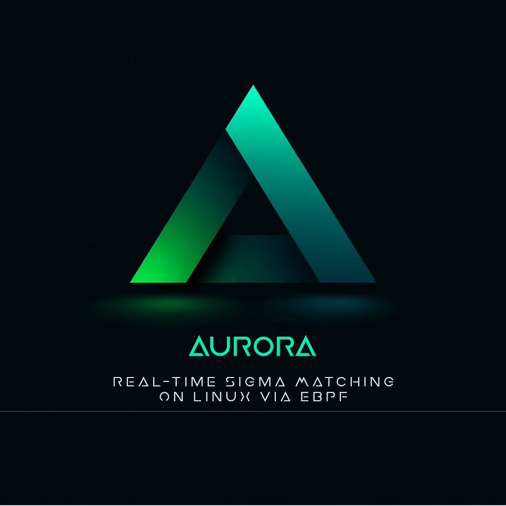
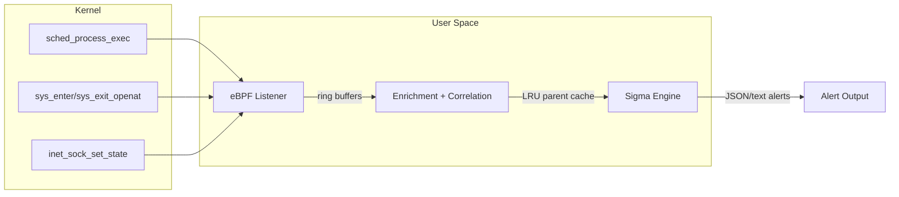

# Aurora Linux

Aurora Linux is a real-time Linux EDR agent.

It attaches eBPF programs to kernel tracepoints, enriches the captured telemetry in user space, and evaluates each event against Sigma rules to emit high-signal alerts in text or JSON. The goal is practical host detection with low overhead and clear, actionable output.



## What It Detects

Aurora Linux loads standard [Sigma rules](https://github.com/SigmaHQ/sigma) for Linux and matches them in real time against three event types:

| Event Type | eBPF Hook | Example Detections |
|---|---|---|
| **Process Creation** | `tracepoint/sched/sched_process_exec` | Reverse shells, base64 decode, webshell child processes, suspicious Java children |
| **File Creation** | `tracepoint/syscalls/sys_{enter,exit}_openat` | Cron persistence, sudoers modification, rootkit lock files, downloads to /tmp |
| **Network Connection** | `tracepoint/sock/inet_sock_set_state` | Bash reverse shells, malware callback ports, C2 on non-standard ports |

## Requirements

- Linux kernel **5.8+** (recommended; 5.2+ with degraded support)
- Root privileges (or `CAP_BPF` + `CAP_PERFMON` + `CAP_SYS_PTRACE`)
- Go 1.24+ (build only)
- clang + libbpf headers (BPF compilation only)

## Quick Start

### Build

```bash
# On a Linux host with clang and bpftool installed:

# 1. Generate vmlinux.h (one-time)
bpftool btf dump file /sys/kernel/btf/vmlinux format c \
    > lib/provider/ebpf/bpf/vmlinux.h

# 2. Compile BPF C programs → Go bindings
go generate ./lib/provider/ebpf/

# 3. Build the binary
go build -o aurora ./cmd/aurora/

# 4. Build the update utility (optional)
go build -o aurora-util ./cmd/aurora-util/
```

Or use Make targets (now synced to `aurora` / `aurora-util` names):

```bash
make build
make test
make vet
```

Linux note:
- `make build` now auto-runs eBPF code generation when generated bindings are missing.
- Required tools on Linux: `bpftool` and `clang`.
- If you want VCS metadata in binaries, override `BUILDVCS=true`:
  - `make build BUILDVCS=true`

### Run

```bash
# Point at the Linux Sigma root directory (subfolders are loaded recursively)
sudo ./aurora --rules /path/to/sigma/rules/linux --json
```

`--rules` is required. Aurora validates rule directories at startup and exits
with an actionable error if the paths are missing or invalid. Unsupported or
unmapped rules are skipped; startup only fails when zero rules are loadable.

For more readable terminal output, pretty-print JSON with `jq`:

```bash
sudo ./aurora --rules ~/sigma/rules/linux/ --json --min-level medium 2>&1 | jq .
```

### Deploy as a Service

```bash
sudo cp aurora /opt/aurora-linux/
sudo cp deploy/aurora.service /etc/systemd/system/
sudo systemctl daemon-reload
sudo systemctl enable --now aurora
```

### Automated Install (Recommended)

```bash
# From a source checkout:
sudo ./scripts/install-service.sh \
  --aurora-binary ./aurora \
  --aurora-util-binary ./aurora-util

# From an extracted release package under /opt/aurora-linux:
sudo /opt/aurora-linux/scripts/install-service.sh
```

Supported distro families:
- Ubuntu/Debian
- RHEL/Fedora
- Arch

The installer:
- installs distro dependencies (`systemd`, `cron/cronie`, `curl`, `tar`, certificates)
- installs binaries and service files under `/opt/aurora-linux`
- installs `/etc/systemd/system/aurora.service`
- updates Sigma signatures (unless `--skip-signature-update`)
- enables and starts `aurora`

### Update Utility

`aurora-util` automates update tasks:

```bash
# Refresh Sigma Linux rules from SigmaHQ releases
sudo ./aurora-util update-signatures

# Upgrade aurora from Aurora-Linux GitHub releases
sudo ./aurora-util upgrade-aurora
```

### Scheduled Maintenance (Cron)

Install nightly maintenance (update signatures + restart service):

```bash
# From source checkout:
sudo ./scripts/install-maintenance-cron.sh --schedule "17 3 * * *"

# Or from installed package path:
sudo /opt/aurora-linux/scripts/install-maintenance-cron.sh --schedule "17 3 * * *"
```

Enable weekly binary upgrade in the same job:

```bash
sudo ./scripts/install-maintenance-cron.sh \
  --schedule "17 3 * * *" \
  --enable-binary-upgrade
```

Installed files:
- `/etc/cron.d/aurora-maintenance`
- `/opt/aurora-linux/bin/aurora-maintenance.sh`
- `/var/log/aurora-linux/maintenance.log`

### Config Templates

Templates shipped for operations customization:
- `/opt/aurora-linux/config/aurora.env.example`
- `/opt/aurora-linux/deploy/templates/rsyslog-aurora.conf.example`
- `/opt/aurora-linux/deploy/templates/aurora-maintenance.cron.example`

Use these to tune Aurora flags and set remote log forwarding.

## Example Output

When a Sigma rule matches, Aurora Linux emits a structured alert:

```json
{
  "level": "info",
  "message": "Sigma match",
  "sigma_rule": "e2072cab-8c9a-459b-b63c-40ae79e27031",
  "sigma_title": "Decode Base64 Encoded Text",
  "sigma_match_fields": ["CommandLine", "Image"],
  "sigma_match_details": {
    "CommandLine": ["base64 -d"],
    "Image": ["base64"]
  },
  "sigma_match_strings": ["'base64 -d' in CommandLine", "'base64' in Image"],
  "rule_id": "e2072cab-8c9a-459b-b63c-40ae79e27031",
  "rule_title": "Decode Base64 Encoded Text",
  "rule_level": "low",
  "rule_author": "Florian Roth",
  "rule_description": "Detects decoding with base64 utility",
  "rule_references": ["https://github.com/SigmaHQ/sigma"],
  "rule_path": "/path/to/sigma/rules/linux/process_creation/proc_creation_lnx_base64_decode.yml",
  "Image": "/usr/bin/base64",
  "CommandLine": "base64 -d /tmp/encoded_payload.b64",
  "ParentImage": "/bin/bash",
  "User": "root",
  "ProcessId": "8421",
  "timestamp": "2026-02-11T12:00:00.000000000Z"
}
```

## Configuration

| Flag | Default | Description |
|---|---|---|
| `-c, --config` | off | Load options from a YAML file (CLI flags override config values) |
| `--rules` | (required) | Sigma rule directories (repeatable, scanned recursively) |
| `-l, --logfile` | off | Output log file path |
| `--logfile-format` | `syslog` (or `json` when `--json`) | Log file format (`syslog` or `json`) |
| `--tcp-target` | off | Forward Sigma matches to TCP `host:port` |
| `--tcp-format` | `syslog` (or `json` when `--json`) | TCP output format (`syslog` or `json`) |
| `--udp-target` | off | Forward Sigma matches to UDP `host:port` |
| `--udp-format` | `syslog` (or `json` when `--json`) | UDP output format (`syslog` or `json`) |
| `--no-stdout` | off | Disable Sigma match output to stdout |
| `--process-exclude` | off | Exclude events with matching process fields (substring match) |
| `--trace` | off | Very-verbose event tracing (logs each observed eBPF event) |
| `--low-prio` | off | Lower process priority via `nice` |
| `--json` | off | JSON output format |
| `--ringbuf-size` | 2048 | Ring buffer size in pages (currently informational; runtime tuning planned) |
| `--correlation-cache` | 16384 | Parent process LRU cache entries |
| `--throttle-rate` | 1.0 | Max Sigma matches per rule per second (`0` disables throttling) |
| `--throttle-burst` | 5 | Burst allowance per rule (used when throttling is enabled) |
| `--min-level` | info | Load only rules at or above this Sigma level (`info`, `low`, `medium`, `high`, `critical`) |
| `--stats-interval` | 60 | Stats logging interval (seconds, 0=off) |
| `-v, --verbose` | off | Debug-level logging |

Operational notes:
- If `--logfile` is set and cannot be opened safely, startup fails.
- `--logfile-format`, `--tcp-format`, and `--udp-format` only accept `syslog` or `json`.
- `--no-stdout` requires at least one enabled sink (`--logfile`, `--tcp-target`, or `--udp-target`).
- Text and JSON alert logs preserve reserved Sigma metadata fields and redact common secret/token patterns in logged fields.
- `--min-level medium` loads only `medium`, `high`, and `critical` rules during startup.

Example YAML config:

```yaml
rules:
  - /opt/sigma/rules/linux
logfile: /var/log/aurora-linux/aurora.log
logfile-format: syslog
tcp-target: myserver.local:514
tcp-format: json
```

## Architecture

Aurora Linux follows a **provider → distributor → consumer** pipeline:

- **Provider** (`lib/provider/ebpf/`) -- eBPF programs attach to kernel tracepoints and deliver events via ring buffers. A userland listener reconstructs full fields from `/proc/PID/*`.
- **Distributor** (`lib/distributor/`) -- Applies enrichment functions (parent process correlation via LRU cache, UID→username resolution) and routes events to consumers.
- **Consumer** (`lib/consumer/sigma/`) -- Evaluates events against loaded Sigma rules using [go-sigma-rule-engine](https://github.com/markuskont/go-sigma-rule-engine). Includes per-rule throttling to suppress duplicate alerts.

### Sigma Field Coverage

| Category | Sigma Fields Covered | Rule Coverage |
|---|---|---|
| `process_creation` | Image, CommandLine, ParentImage, ParentCommandLine, User, LogonId, CurrentDirectory | 119/119 rules (100%) |
| `file_event` | TargetFilename, Image | 8/8 rules (100%) |
| `network_connection` | Image, DestinationIp, DestinationPort, Initiated | 2/5 rules (40%) -- remaining 3 need DNS correlation |

## Project Structure

```
aurora-linux/
├── cmd/aurora/                CLI entry point (cobra)
├── cmd/aurora-util/           Release update utility (signatures + binary)
├── scripts/                   Install + maintenance automation
├── lib/
│   ├── provider/ebpf/         eBPF listener + BPF C programs
│   ├── provider/replay/       JSONL replay provider (for CI)
│   ├── distributor/           Event routing + enrichment
│   ├── enrichment/            DataFieldsMap, correlator cache
│   ├── consumer/sigma/        Sigma rule evaluation
│   └── logging/               JSON + text formatters
├── resources/log-sources/     Legacy Sigma category→provider mapping files (not currently consumed by runtime)
├── deploy/                    systemd + template configs
└── docs/                      Design plan + developer guide
```

## Documentation

- **[Developer Guide](docs/DEVELOPER.md)** -- Codebase walkthrough, design decisions, what works, what needs work. Start here if you're contributing.
- **[Technical Design Plan](docs/plan_aurora_linux_ebpf_sigma.md)** -- Full technical specification with BPF struct definitions, field mapping tables, worked examples, and performance analysis.

## Development

```bash
# Build (compiles on macOS via stubs, runs on Linux only)
go build ./...

# Run tests (field mapping, enrichment, correlator)
go test ./...

# Lint
go vet ./...
```

## License

GPL-3.0. See [LICENSE](LICENSE).
